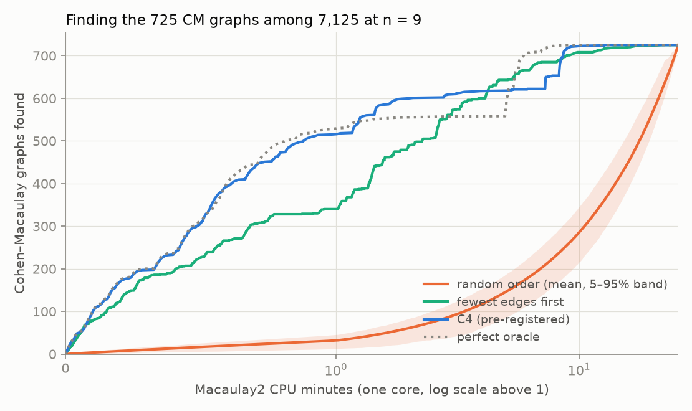

# n = 9 results

Pre-registered predictions: commit `26f8783`. Raw results committed before scoring: `fb90de6`.

Graphs failing OCC: 7125. Proven CM: 725. Proven not CM: 6400. Undecided: 0 [].
How decided: {'negative_h': 6400, 'depth_ZZp_eq_n': 725}.

## C4 (pre-registered) vs truth

| | actually CM | actually not CM |
|---|---|---|
| C4 predicted CM | 618 | 21 |
| C4 predicted not CM | 107 | 6379 |

Accuracy 0.9820. Precision for CM 0.967, recall for CM 0.852.

**C4′ (even cycle meets a separated pair ⇒ not CM):** 107 counterexamples [7823, 20331, 24398, 52930, 92758, 92788, 92948, 92949, 92951, 92952, 92953, 92954, 92955, 92956, 92957, 92959, 92960, 92961, 92962, 92963, 92964, 92965, 92966, 92967, 92968, 92969, 92970, 92971, 92972, 92973] ….
**C4 ⇐ direction (no such cycle ⇒ CM):** 21 counterexamples: [7161, 7758, 7921, 20329, 20366, 30719, 91929, 92977, 92978, 92981, 92987, 92990, 92998, 93003, 98072, 108918, 110305, 110339, 110448, 111456, 126265]

## C2: not CM ⇔ some h-coefficient is negative (failing graphs)

Negative h: 6400, all not CM (theorem). Nonnegative h: 725, of which not CM: 0. Depth over ZZ/32003 re-measured for all 725 nonnegative-h graphs: {9: 725} (value: count).
So at n = 9, as at n = 8, the Hilbert series alone decides CM for every failing graph.

Top h-coefficient among non-CM graphs: {-4: 210, -3: 7, -2: 905, -1: 1486, 1: 3667, 2: 120, 3: 5}.

## C1: Gorenstein ⇔ complete intersection (CM failing graphs)

CM 725; Gorenstein 41; complete intersections 23; CI but not Gorenstein 0 (must be 0); Gorenstein but not CI 18: [8866, 10185, 19757, 24276, 50714, 108979, 108980, 108991, 108992, 109002, 109532, 109537, 111232, 111233, 111241, 111243, 111244, 111253]

| graph | m | codim | gens | degrees | h |
|---|---|---|---|---|---|
| 8866 | 12 | 3 | 5 | {2, 2, 2, 5, 5} | (1, 3, 3, 3, 3, 1) |
| 10185 | 13 | 4 | 9 | {2, 2, 2, 2, 2, 2, 5, 5, 5} | (1, 4, 4, 4, 4, 1) |
| 19757 | 12 | 3 | 5 | {2, 2, 2, 5, 5} | (1, 3, 3, 3, 3, 1) |
| 24276 | 13 | 4 | 6 | {2, 2, 2, 2, 2, 4} | (1, 4, 5, 5, 4, 1) |
| 50714 | 13 | 4 | 6 | {2, 2, 2, 2, 4, 4} | (1, 4, 6, 6, 4, 1) |
| 108979 | 13 | 4 | 6 | {2, 2, 2, 2, 4, 4} | (1, 4, 6, 6, 4, 1) |
| 108980 | 13 | 4 | 6 | {2, 2, 2, 2, 2, 4} | (1, 4, 5, 5, 4, 1) |
| 108991 | 13 | 4 | 6 | {2, 2, 2, 2, 4, 4} | (1, 4, 6, 6, 4, 1) |
| 108992 | 14 | 5 | 7 | {2, 2, 2, 2, 2, 2, 3} | (1, 5, 9, 9, 5, 1) |
| 109002 | 14 | 5 | 7 | {2, 2, 2, 2, 2, 3, 3} | (1, 5, 10, 10, 5, 1) |
| 109532 | 13 | 4 | 6 | {2, 2, 2, 2, 2, 4} | (1, 4, 5, 5, 4, 1) |
| 109537 | 14 | 5 | 7 | {2, 2, 2, 2, 2, 2, 3} | (1, 5, 9, 9, 5, 1) |
| 111232 | 14 | 5 | 10 | {2, 2, 2, 2, 2, 2, 2, 2, 2, 4} | (1, 5, 6, 6, 5, 1) |
| 111233 | 14 | 5 | 7 | {2, 2, 2, 2, 2, 2, 3} | (1, 5, 9, 9, 5, 1) |
| 111241 | 14 | 5 | 10 | {2, 2, 2, 2, 2, 2, 2, 2, 4, 4} | (1, 5, 7, 7, 5, 1) |
| 111243 | 14 | 5 | 10 | {2, 2, 2, 2, 2, 2, 2, 4, 4, 4} | (1, 5, 8, 8, 5, 1) |
| 111244 | 15 | 6 | 11 | {2, 2, 2, 2, 2, 2, 2, 2, 2, 2, 3} | (1, 6, 11, 11, 6, 1) |
| 111253 | 15 | 6 | 11 | {2, 2, 2, 2, 2, 2, 2, 2, 2, 3, 3} | (1, 6, 12, 12, 6, 1) |

## Ordering experiment: how fast are the CM graphs found?

Total Macaulay2 CPU for all 7125 graphs: 25.5 min on one core (the wall-clock run was dominated by Macaulay2 start-up, ~2 s per launch).

| order | CPU to find 50% of CM | graphs screened | CPU to find 90% | graphs screened |
|---|---|---|---|---|
| random (median of 2000) | 12.7 min | 3565 | 23.2 min | 6415 |
| C4 (pre-registered) | 0.55 min | 379 | 7.74 min | 2541 |
| fewest edges first | 1.10 min | 1198 | 5.43 min | 3867 |
| perfect oracle | 0.56 min | 363 | 5.44 min | 653 |

C4 vs random: **23.1×** less CPU to reach 50% of CM graphs, 3.0× to reach 90%. C4 vs fewest-edges-first: **2.0×** (50%), 0.7× (90%). Perfect-oracle ceiling vs random: 22.7× (50%).

